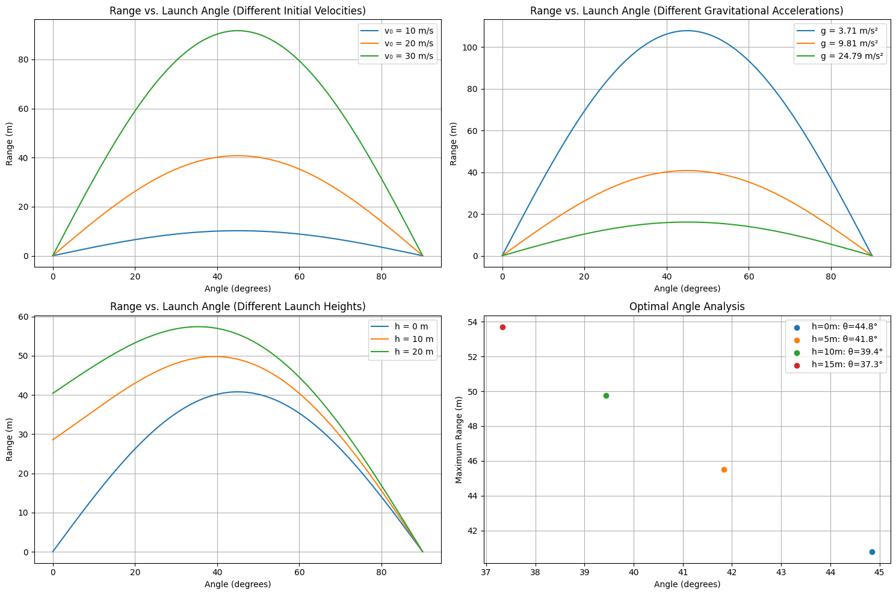

# Problem 1

**Investigating the Range as a Function of the Angle of Projection**

### **Motivation**
Projectile motion, while seemingly simple, provides a rich framework for exploring fundamental principles of physics. The problem at hand is straightforward: analyze how the range of a projectile depends on its angle of projection. Despite its simplicity, the topic involves complex relationships governed by both linear and quadratic equations, making it an insightful subject of study.

A key factor that makes this investigation compelling is the number of free parameters involved in projectile motion equations, such as initial velocity, gravitational acceleration, and launch height. These parameters contribute to a diverse set of solutions that model real-world scenarios, from the trajectory of a soccer ball to the flight path of a missile.

---

### **Task**

#### **1. Theoretical Foundation**
To analyze the range as a function of the angle of projection, we start by deriving the governing equations from fundamental principles of kinematics and dynamics. The motion of a projectile in the absence of air resistance follows Newton’s second law:

- **Equations of Motion:**
  - Horizontal displacement: $$ x = v_0 \cos(\theta) t $$
  - Vertical displacement: $$ y = v_0 \sin(\theta) t - \frac{1}{2}gt^2 $$

Solving these equations yields the total time of flight \( T \):
  $$ T = \frac{2v_0 \sin(\theta)}{g} $$

Substituting into the horizontal displacement equation, we obtain the range \( R \):
  $$ R = \frac{v_0^2 \sin(2\theta)}{g} $$

This equation shows that the range depends on the square of the initial velocity and the sine of twice the projection angle.

#### **2. Analysis of the Range**
- The range \( R \) is maximized when \( \sin(2\theta) \) reaches its maximum value (1), which occurs at \( 2\theta = 90^\circ \), or \( \theta = 45^\circ \).
- Increasing the initial velocity \( v_0 \) increases the range quadratically.
- A higher gravitational acceleration \( g \) reduces the range.
- For non-zero launch height, the equation for \( R \) becomes more complex, requiring further analysis.

#### **3. Practical Applications**
- **Sports:** Understanding how the angle influences projectile range helps optimize techniques in soccer, basketball, and javelin throwing.
- **Engineering:** In artillery and missile technology, precise control over launch angles is essential for maximizing impact range.
- **Space Exploration:** The principles of projectile motion extend to orbital mechanics and spacecraft trajectory planning.

#### **4. Implementation**
To further analyze the range as a function of the projection angle, a computational tool can be developed:
- **Algorithm:** Implement numerical simulations in Python or MATLAB to visualize projectile motion under varying conditions.
- **Graphical Representation:** Generate plots of range versus launch angle to observe the dependency.
- **Advanced Considerations:** Extend the model to include air resistance, variable wind conditions, and non-flat terrain.

---

### **Conclusion**
The study of projectile motion offers valuable insights into both theoretical physics and practical applications. By understanding the mathematical framework and leveraging computational tools, we can develop a deeper appreciation of how varying initial conditions affect a projectile’s trajectory. Future work may involve refining the model with real-world complexities such as air resistance and varying gravitational fields.

